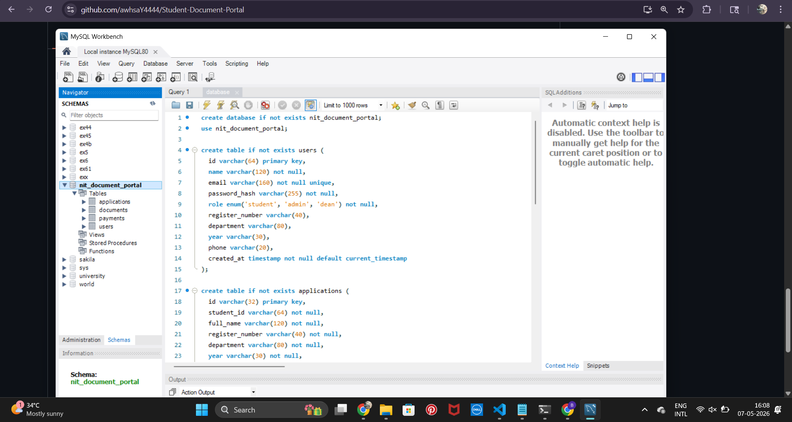

# NIT Student Document Management Portal

Internal college ERP-style MVP for student document requests. It includes role-based login, Razorpay test payment flow, MySQL-backed application records, admin approval/upload/generation of PDFs, student downloads, and dean analytics.

## Demo Accounts

| Role | Email | Password |
| --- | --- | --- |
| Student | nit07052601@ac.in | nit07052601 |
| Admin | nitadmin@ac.in | adminnit2026 |
| Dean | nitdean@ac.in | deannit2026 |

## Quick Start

```bash
npm install
npm run dev
```

Open `http://localhost:5173`.

The app uses MySQL when `DB_CLIENT=mysql` is configured. Uploaded PDFs are stored under `server/uploads`. Paid document requests require Razorpay Test Mode keys.

## Environment Setup

Copy `.env.example` to `.env` and fill values for a MySQL/Razorpay-backed run.

```bash
cp .env.example .env
```

For MySQL, create the database and tables first:

```bash
mysql -u root -p < database.sql
npm run seed:mysql
```

## MySQL Setup

1. Install/start MySQL.
2. Run `database.sql`.
3. Add `.env` values for `DB_CLIENT`, `MYSQL_HOST`, `MYSQL_PORT`, `MYSQL_USER`, `MYSQL_PASSWORD`, and `MYSQL_DATABASE`.
4. Seed the evaluation accounts:

```bash
npm run seed:mysql
```

## MySQL Database Schema

The application uses MySQL as the primary relational database.

### Database: `nit_document_portal`

#### Main Tables

- users
- applications
- payments
- documents

### MySQL Workbench Preview



### Database Features

- Relational schema design
- Foreign key relationships
- JWT-based authentication support
- Role-based access structure
- Payment and document tracking
- Indexed application queries
- Local document storage integration

## Razorpay Test Mode

Add test keys to `.env`:

```env
RAZORPAY_KEY_ID=rzp_test_xxxxxxxxxx
RAZORPAY_KEY_SECRET=your-test-secret
```

Restart the backend after adding keys. Paid requests open Razorpay Checkout and the backend verifies the returned payment signature before creating the application.

## Implemented Workflow

- Student logs in and submits a document request.
- Fee is calculated from document type.
- Razorpay test payment is opened for paid documents and verified by the backend.
- Application and payment are stored through the API.
- A jsPDF payment receipt is generated and uploaded automatically.
- Admin reviews applications, adds remarks, approves/rejects, uploads PDFs, or generates official PDFs.
- Student downloads receipts and approved documents.
- Dean sees read-only analytics using Recharts.

## Document Pricing

| Document | Fee |
| --- | ---: |
| Transcript | INR 1000 |
| Marksheet | INR 1000 |
| Fee Receipt | INR 0 |
| Bonafide Certificate | INR 1000 |
| Transfer Certificate | INR 1000 |

## Project Structure

```text
src/
  api/              API client
  components/       Shared layout, tables, badges, modals
  context/          Auth context
  pages/            Student, Admin, Dean, Login screens
  utils/            PDF and formatting helpers
server/
  index.js          Express API
  lib/store.js      MySQL data access and auth helpers
  uploads/          Local uploaded/generated PDF files
config/
  db.js             MySQL connection pool
database/
  # legacy/optional database folder
scripts/
  seed-mysql.js     MySQL demo users with bcrypt password hashes
database.sql        MySQL schema for users, applications, payments, documents
.env.example        MySQL, JWT, and Razorpay environment template
```
